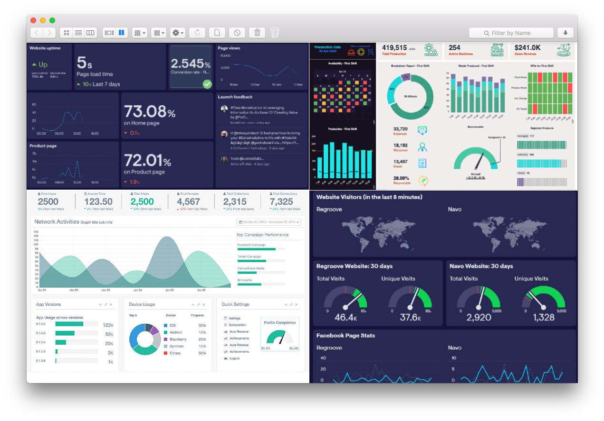

# web-wall

Create dashboards aggregating data from different websites and displaying them on a single page.

In many cases this is easy to achieve when the dashboards are loaded by a computer plugged to the displays or TVs.
But if your options are limited to using a TV browser instead, then web-wall can help you to achieve a similar result.  

Web-wall captures periodical screenshots of the websites you want in your dashboard and displays them in a single page.



## How it works

The server has two endpoints:

| Endpoint           | Description                                                                                                                                                                                         |
| ------------------ | --------------------------------------------------------------------------------------------------------------------------------------------------------------------------------------------------- |
| `GET /`            | returns the HTML content for the page displaying the wall - invoked by the browser.                                                                                                                 |
| `GET /screenshots` | returns a Json response containing a map of urls (key) to base64 encoded images (values) - invoked by the HTML page to periodically fetch the screenshots configured. The response is gzip encoded. |

## Configuration

### Config file

Configure the refresh interval and the URLs you want to fetch in the file `config/default.json`.

#### Attributes

| Attribute                   | Type   | Description                                                | Mandatory   |
| --------------------------- | ------ | ---------------------------------------------------------- | ----------- |
| `refreshInterval`           | number | refresh interval in seconds                                | Y           |
| `columns`                   | number | number of columns to display in the grid                   | Y           |
| `websites[].url`            | string | the URL to fetch                                           | Y           |
| `websites[].headers`        | object | key-value map of request headers                           | N           |
| `websites[].cookies`        | array  | list of cookies (as string) to send as part of the request | N           |
| `websites[].authentication` | object | credentials to use for basic authentication                | N           |

#### Example

```
[~/web-wall]$ cat config/default.json
{
  "refreshInterval": 10,
  "columns": 2,
  "websites": [
    {
      "url": "https://time.is/",
      "headers": {
        "Accept-Language": "en-US,en;q=0.5"
      },
      "cookies": [
        "id=unicorn; Expires=Wed, 1 Dec 2021 23:59:00 GMT;"
      ],
      "authentication": {
        "username": "foo",
        "password": "bar"
      }
    },
    {
      "url": "https://www.epochconverter.com/"
    }
  ]
}%
```

### Environment variables

These variables are used to template the HTML page so that it can talk to the server.

| Variable        | Description           |
| --------------- | --------------------- | 
| `SERVER_SCHEME` | server request scheme | 
| `SERVER_HOST`   | server hostname       | 
| `SERVER_PORT`   | server port           | 

## Run it

### Docker

```
[~/.]$ docker run -p 8080:8080 docker.pkg.github.com/paoloboni/web-wall/web-wall
```

#### Override the configuration

Assuming you created a configuration file `customised-config.json` under your home directory:

```
[~/.]$ docker run \
    -p 8080:8080 \
    -v $(pwd)/customised-config.json:/usr/src/config/default.json \
    docker.pkg.github.com/paoloboni/web-wall/web-wall
```

#### Environment variables

You can use the same environment variables listed above to configure server port, host and request scheme.

For instance, you may want to run the container on the port 9090 instead of the default one:

```
[~/.]$ docker run \
    -e SERVER_PORT=9090 \
    -p 9090:9090 \
    docker.pkg.github.com/paoloboni/web-wall/web-wall
```

### Locally

The only requirement is to have [Node.js](https://nodejs.dev) installed.

#### Install the dependencies

```
[~/web-wall]$ npm install
```

#### Run the server

```
[~/web-wall]$ npm start

> web-wall@1.0.0 start
> node app/server.js

app listening at http://localhost:8080
```

#### Run the tests

```
[~/web-wall]$ npm test
```

## Caveats

The server runs on Node.js which, due to its architectural limitations, makes the process hard to scale on a single instance.

If you have to serve a large number of walls, the advice is to configure and run one instance for each wall, as opposed to serve a different page for each wall. 
 